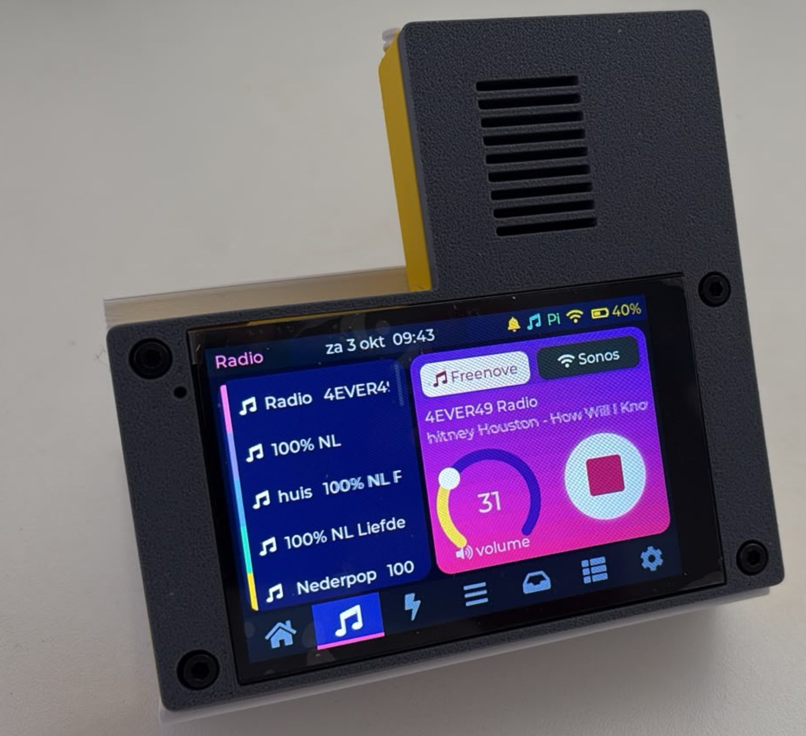
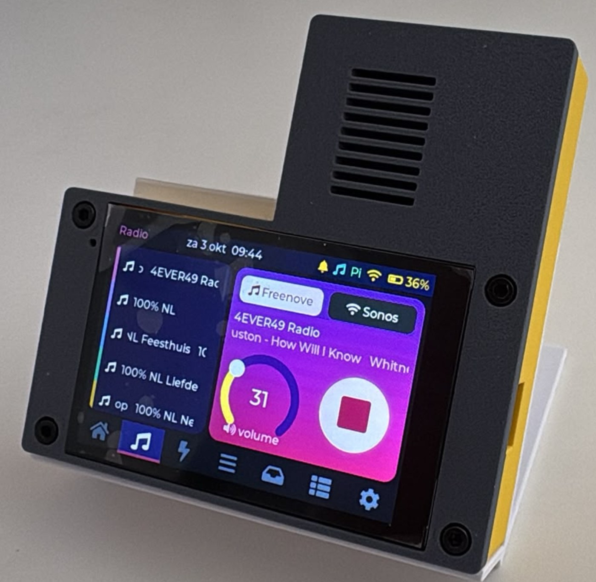
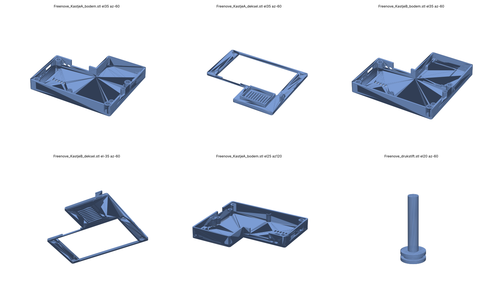
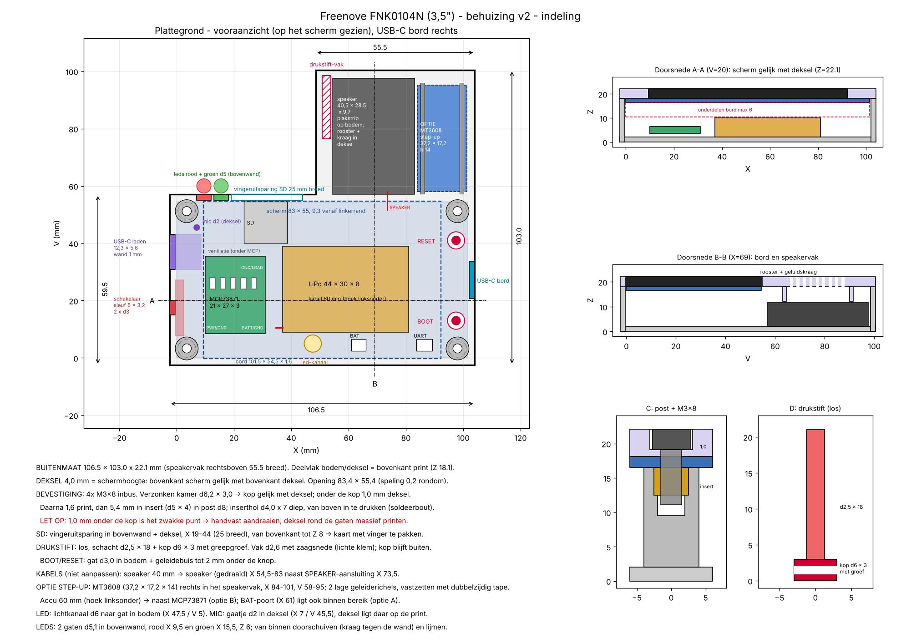

# Freenove FNK0104N (3,5") - startmenu, Bin Maker en behuizing

*English version: [README.md](README.md)*

  
  

  

Eigen project rond de **Freenove ESP32-S3 Display FNK0104N** (3,5", 320x480, capacitive touch):
een startmenu dat programma's van de SD-kaart start, een Tkinter-hulpprogramma om die programma's te maken,
hardwaretests en een 3D-geprinte behuizing met accu-UPS.

## Inhoud

| Map | Wat |
|---|---|
| `FNK0104N_Startmenu_v0_2/` | Startmenu: kiest en start programma's (`.bin`) van de SD-kaart |
| `FNK0104N_Volledige_Test/` | Volledige hardwaretest: scherm, touch, geluid + microfoon, LED, WiFi, BOOT, batterij |
| `FNK0104N_SD_Test/` | SD-kaarttest (lezen/schrijven) |
| `FNK0104N_TestA/`, `FNK0104N_TestB/` | Kleine testprogramma's voor het startmenu |
| `FNK0104N_Hulpmiddelen/` | Bin Maker 2.1 (Tkinter): maakt van een programma een `.bin` voor het startmenu |
| `FKN0104N_Case/` | Behuizing: bouwgids (PDF), indelingstekening en STL-bestanden |

## Wat er gedaan is

### Opzet en eerste tests

* Arduino IDE ingericht voor de Freenove FNK0104N: ESP32-S3, 16 MB flash, OPI PSRAM, de juiste libraries.
* Volledige hardwaretest gemaakt: scherm, touch, geluid met microfoon, LED, WiFi, BOOT-knop en batterij.
* SD-kaarttest gemaakt: lezen en schrijven werkt (1 GB-kaart, 665 kB/s schrijven, 4830 kB/s lezen).

### Startmenu (keuzemenu)

* Een eigen indeling van het geheugen gemaakt: een vast vak voor het startmenu, twee vakken voor programma's (app0 en app1), en de instellingen blijven op hun plek.
* Het startmenu toont een kleurrijke lijst van de programma's op de SD-kaart (map `/programmas`), met naam en grootte. Na bevestigen kopieert het het programma met een voortgangsbalk en start het. Een programma dat al geladen is, start direct.
* In elk programma brengt BOOT 2 s vasthouden je terug naar het menu. Updates via WiFi laten het startmenu met rust.
* Getest op het board: terug naar het menu werkt, WiFi en wachtwoorden bleven bewaard, en kopieren gaat met 128 kB/s.

### Bin Maker (Tkinter-hulpprogramma)

* Van een origineel programma maakt hij een `_BIN`-map: een aangepaste kopie met de startmenu-indeling en de terug-knop. Daarvan compileert hij de `.bin` en zet die in `programmas` en eventueel op de SD-kaart. Het origineel blijft ongewijzigd.
* Versie 2.1 heeft een knop "Maak .bin", een Help-venster, en controleert of het origineel gewijzigd is. Hij werkt op een Windows-pc met de Arduino IDE (gebruikt de `arduino-cli` van de IDE).
* Starten: `FNK0104N_Hulpmiddelen/Start_Bin_Maker.bat`. Uitleg: `FNK0104N_Hulpmiddelen/LEESMIJ.txt`.

### Behuizing, voeding en bouwgids

* Behuizing voor het 3,5"-bord (101,5 x 54,5 mm) in twee varianten:
  **kastje A** zonder step-up (106,5 x 90 x 22,1 mm) en **kastje B** met MT3608 step-up (106,5 x 103 x 22,1 mm).
* Scherm gelijk met het deksel, M3x8-bouten in messing inserts, speaker met rand, klemhaakjes voor het deksel,
  USB-C-laadpoort en schakelaar, laadleds (rood = laden, groen = vol), drukstift voor BOOT/RESET, tafelstandaard.
* Voeding: USB-C -> MCP73871 (laden + load-sharing/UPS) -> LiPo 1000 mAh; via de schakelaar naar de 5V-pen van de UART-aansluiting
  (kastje B via een MT3608 step-up op 5,1 V).
* Bouwgids met onderdelenlijst, bedradingsschema per draad, kabellijst, maatvoering en stappenplan:
  `FKN0104N_Case/Freenove_FNK0104N_bouwgids_v2.pdf`.
* STL-bestanden: `FKN0104N_Case/STL_v2/` (bodem en deksel A/B, drukstift, standaard).

## Gebruik in het kort

1. Arduino IDE (Tools): board ESP32S3 Dev Module, USB CDC On Boot Enabled, Flash Size 16MB, PSRAM OPI PSRAM. De `partitions.csv` in de sketchmap bepaalt de geheugenindeling.
2. Startmenu een keer via USB uploaden (`FNK0104N_Startmenu_v0_2`).
3. Programma's met de Bin Maker omzetten naar `.bin` en in `/programmas` op de SD-kaart zetten.
4. In een programma: BOOT 2 s vasthouden = terug naar het startmenu.

## Nog te doen

* ~~Kastje B printen en de pasvorm controleren.~~ Gedaan (3 okt 2026): kastje B geprint, past.
* Meten of de UART-5V-pen een voedingsingang is; STAT1/STAT2 op de laadmodule zoeken voor de leds.
* Laadtest en eindtest op de accu.

## Code van derden

* De ES8311-audiodriver (`es8311.*`) komt uit de voorbeelden van Freenove en valt onder hun eigen licentie.
* Freenove-documentatie en voorbeelden: https://github.com/Freenove/Freenove_ESP32_S3_Display

## Licentie

* 3D-bestanden (STL) en de bouwgids: **CC BY-SA 4.0**.
* De standaard (`Freenove_standaard.stl`) is een remix van
  ["M5Stack simple stand" van hkawakami](https://makerworld.com/models/537572), CC BY-SA 4.0.
